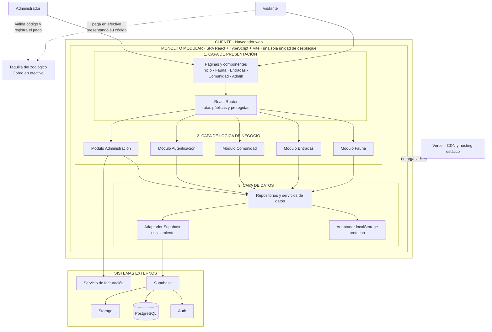
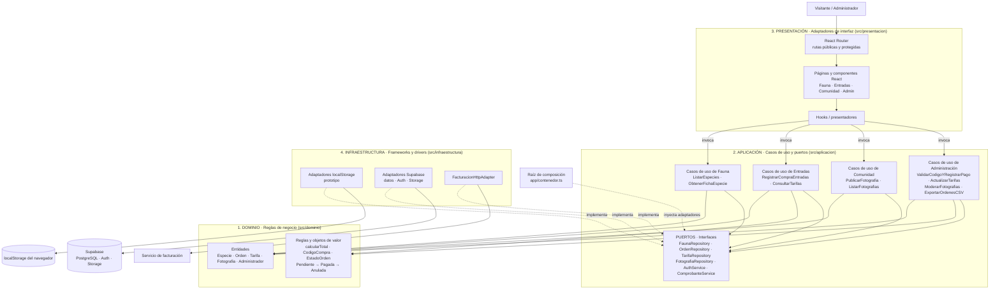

# Parque Zoológico La Totorilla - Plataforma Web

> Plataforma web interactiva del Parque Zoológico La Totorilla (Ayacucho, Perú).
> **Curso:** IS-488 Arquitectura de Software · UNSCH · Semestre 2026-II
> **Sitio desplegado:** [zoologico-totorilla.vercel.app](https://zoologico-totorilla.vercel.app)

---

## Tabla de contenido

1. [Necesidad del negocio](#1-necesidad-del-negocio)
2. [Actores](#2-identificar-actores)
3. [Historias de usuario](#3-identificar-historias-de-usuario)
4. [Requisitos funcionales](#4-identificar-requisitos-funcionales)
5. [Relación entre HU y requisitos funcionales](#5-relación-entre-hu-y-requisitos-funcionales)
6. [Atributos de calidad](#6-identificar-atributos-de-calidad)
7. [Restricciones](#7-identificar-restricciones)
8. [Drivers arquitectónicos](#8-identificar-drivers-arquitectónicos)
9. [Decisiones arquitectónicas (ADR)](#9-decisiones-arquitectónicas-adr)
10. [Estilo arquitectónico](#10-estilo-arquitectónico)
11. [Enfoque arquitectónico: Clean Architecture](#11-enfoque-arquitectónico-clean-architecture)
12. [Tecnologías y ejecución](#12-tecnologías-y-ejecución)

---

# 1. Necesidad del negocio

El proyecto consiste en desarrollar una plataforma web para el **Parque Zoológico La Totorilla**, ubicado en Ayacucho. El sistema busca digitalizar parte de la experiencia del visitante, permitiendo consultar información del zoológico, conocer las especies disponibles, revisar características y contenido educativo de los animales y planificar una visita desde un navegador web.

La plataforma incorpora un módulo de **registro de entradas online**, mediante el cual el visitante selecciona tipos y cantidades de entradas, elige la fecha de visita, registra sus datos y obtiene un **código de compra**. Dado que el establecimiento **solo cuenta con pago en efectivo**, el cobro se realiza en taquilla al momento del ingreso, presentando dicho código. Actualmente, la información se almacena localmente en el navegador como parte del prototipo académico.

Además, el sistema dispone de una sección de comunidad donde los visitantes pueden compartir fotografías de su visita y de un **panel de administración** para consultar órdenes, validar códigos de compra, gestionar tarifas, moderar fotografías y revisar el catálogo de especies.

La solución se plantea inicialmente como una aplicación web de tipo SPA, pero su arquitectura debe permitir evolucionar desde el almacenamiento local hacia una infraestructura centralizada basada en **Supabase**, de manera que el sistema pueda crecer, compartir información entre usuarios y soportar una mayor cantidad de operaciones.

## Problema y objetivos del negocio

| ID | Objetivo del negocio | Resultado esperado |
|---|---|---|
| OB01 | Digitalizar la información del zoológico (horarios, ubicación, tarifas y fauna). | Visitantes mejor informados antes y durante su visita. |
| OB02 | Facilitar la planificación de la visita mediante el registro anticipado de entradas. | Mayor orden en el ingreso y mejor control de las entradas por fecha. |
| OB03 | Fomentar el aprendizaje sobre las especies mediante contenido educativo interactivo. | Mejor experiencia educativa y recreativa. |
| OB04 | Crear una comunidad de visitantes que comparta fotografías. | Mayor interacción y difusión del zoológico. |
| OB05 | Centralizar la administración de órdenes, tarifas y contenido. | Gestión más rápida, ordenada y controlada por personal autorizado. |
| OB06 | Preparar la plataforma para crecer y compartir datos entre usuarios. | Evolución del almacenamiento local a una base de datos centralizada (Supabase). |

---

# 2. Identificar actores

Los actores representan las personas o sistemas externos que interactúan con la plataforma.

| ID | Actor | Tipo | ¿Qué necesita realizar? |
|---|---|---|---|
| A01 | Visitante | Humano | Consultar información del zoológico, explorar animales, registrar la compra de entradas y compartir fotografías. |
| A02 | Administrador | Humano | Gestionar entradas, tarifas, fotografías de visitantes, validar códigos de compra, registrar pagos en efectivo y consultar indicadores básicos. |
| A03 | Servicio de facturación | Sistema externo | Generar comprobantes electrónicos asociados a las compras cuyo pago en efectivo fue confirmado. |
| A04 | Supabase | Sistema externo / Plataforma | Proporcionar autenticación, base de datos y almacenamiento centralizado para la aplicación. |

> **Nota:** En el prototipo actual las órdenes, precios, fotografías y sesión administrativa utilizan `localStorage`. En la arquitectura propuesta se considera **Supabase como infraestructura de persistencia y servicios para la etapa de escalamiento**. El pago se realiza **únicamente en efectivo, en taquilla**; no existe integración con pasarelas de pago.

---

# 3. Identificar historias de usuario

> **Como [actor], quiero [acción], para [beneficio].**

| ID | Historia de usuario |
|---|---|
| HU01 | Como visitante, quiero consultar información general del zoológico, para conocer sus horarios, ubicación, tarifas y servicios. |
| HU02 | Como visitante, quiero explorar las especies del zoológico, para conocer sus características, hábitat y estado de conservación. |
| HU03 | Como visitante, quiero consultar la ficha detallada de un animal, para obtener información educativa y datos curiosos sobre la especie. |
| HU04 | Como visitante, quiero interactuar con recursos educativos como sonidos y cuestionarios, para aprender de manera entretenida. |
| HU05 | Como visitante, quiero seleccionar y registrar mis entradas online, para pagarlas en efectivo en taquilla sin hacer cola de compra. |
| HU06 | Como visitante, quiero seleccionar la fecha de mi visita, para planificar mi asistencia al zoológico. |
| HU07 | Como visitante, quiero recibir un código de compra después de registrar mis entradas, para presentarlo en taquilla al momento de pagar. |
| HU08 | Como visitante, quiero compartir fotografías de mi visita, para participar en la comunidad del zoológico. |
| HU09 | Como administrador, quiero iniciar sesión en el panel administrativo, para acceder de manera restringida a las funciones de gestión. |
| HU10 | Como administrador, quiero consultar las órdenes registradas, para controlar las entradas vendidas. |
| HU11 | Como administrador, quiero modificar las tarifas de las entradas, para mantener actualizados los precios del zoológico. |
| HU12 | Como administrador, quiero moderar las fotografías publicadas por visitantes, para mantener controlado el contenido de la comunidad. |
| HU13 | Como administrador, quiero consultar el catálogo de animales publicado, para verificar el contenido disponible en la plataforma. |
| HU14 | Como administrador, quiero validar el código de compra y registrar el pago en efectivo, para confirmar el ingreso del visitante y emitir su comprobante. |

---

# 4. Identificar requisitos funcionales

| ID | Requisito funcional |
|---|---|
| RF01 | El sistema debe permitir consultar información general del zoológico. |
| RF02 | El sistema debe permitir consultar horarios, ubicación y tarifas. |
| RF03 | El sistema debe permitir mostrar el listado de especies disponibles. |
| RF04 | El sistema debe permitir consultar el detalle de una especie. |
| RF05 | El sistema debe permitir reproducir sonidos asociados a determinadas especies. |
| RF06 | El sistema debe permitir mostrar datos curiosos e información educativa de los animales. |
| RF07 | El sistema debe permitir realizar cuestionarios interactivos relacionados con las especies. |
| RF08 | El sistema debe permitir seleccionar cantidades de entradas según su categoría. |
| RF09 | El sistema debe permitir seleccionar la fecha de visita. |
| RF10 | El sistema debe permitir registrar nombre y correo electrónico del visitante. |
| RF11 | El sistema debe calcular automáticamente el total de la compra. |
| RF12 | El sistema debe registrar la orden con estado «Pendiente de pago», indicando que el pago se realizará en efectivo en taquilla. |
| RF13 | El sistema debe generar un código único asociado a la compra. |
| RF14 | El sistema debe generar o solicitar el comprobante de pago mediante un servicio de facturación una vez confirmado el pago en efectivo. |
| RF15 | El sistema debe permitir registrar fotografías de los visitantes. |
| RF16 | El sistema debe permitir eliminar fotografías publicadas en el muro comunitario. |
| RF17 | El sistema debe permitir al administrador iniciar sesión. |
| RF18 | El sistema debe restringir el acceso al panel administrativo a usuarios autorizados. |
| RF19 | El sistema debe permitir consultar las órdenes registradas. |
| RF20 | El sistema debe permitir eliminar órdenes registradas. |
| RF21 | El sistema debe permitir exportar las órdenes a formato CSV. |
| RF22 | El sistema debe permitir modificar las tarifas de las entradas. |
| RF23 | El sistema debe permitir restablecer las tarifas a sus valores base. |
| RF24 | El sistema debe permitir al administrador moderar y eliminar fotografías. |
| RF25 | El sistema debe permitir consultar el catálogo de especies desde el panel administrativo. |
| RF26 | El sistema debe permitir al administrador validar un código de compra y marcar la orden como «Pagada» al recibir el efectivo en taquilla. |
| RF27 | El sistema debe almacenar la información de usuarios, compras, especies, fotografías y tarifas en una base de datos centralizada cuando se implemente Supabase. |

---

# 5. Relación entre HU y requisitos funcionales

| Historia de usuario | Requisitos funcionales relacionados |
|---|---|
| HU01 Consultar información general | RF01, RF02 |
| HU02 Explorar especies | RF03, RF04 |
| HU03 Consultar ficha de animal | RF04, RF06 |
| HU04 Interactuar con recursos educativos | RF05, RF06, RF07 |
| HU05 Registrar entradas online | RF08, RF11, RF12, RF13 |
| HU06 Seleccionar fecha de visita | RF09 |
| HU07 Recibir código de compra | RF13 |
| HU08 Compartir fotografías | RF15 |
| HU09 Iniciar sesión administrativa | RF17, RF18 |
| HU10 Consultar órdenes | RF19, RF20, RF21 |
| HU11 Modificar tarifas | RF22, RF23 |
| HU12 Moderar fotografías | RF16, RF24 |
| HU13 Consultar catálogo publicado | RF25 |
| HU14 Validar código y registrar pago en efectivo | RF14, RF26 |
| HU05/HU07 Proceso completo de compra | RF10, RF11, RF12, RF13, RF14, RF27 |

---

# 6. Identificar atributos de calidad

| ID | Atributo de calidad | Escenario de calidad |
|---|---|---|
| AC01 | Rendimiento | Las páginas de inicio, fauna y entradas deben responder rápidamente incluso cuando varios visitantes consulten el sistema simultáneamente. |
| AC02 | Disponibilidad | La plataforma debe permanecer disponible para permitir consultar información y registrar compras durante el horario de atención. |
| AC03 | Escalabilidad | La arquitectura debe permitir aumentar la cantidad de usuarios y operaciones sin rediseñar completamente la aplicación. |
| AC04 | Seguridad | La información de administradores, órdenes y datos de visitantes debe estar protegida frente a accesos no autorizados. |
| AC05 | Usabilidad | El visitante debe poder consultar animales y registrar entradas mediante una interfaz sencilla e intuitiva. |
| AC06 | Mantenibilidad | Los cambios en fauna, entradas, comunidad o administración deben poder realizarse sin afectar innecesariamente otros módulos. |
| AC07 | Compatibilidad | La aplicación debe funcionar correctamente en navegadores web modernos y diferentes tamaños de pantalla. |
| AC08 | Integridad de datos | Las compras, precios, usuarios y registros almacenados deben conservar consistencia entre las operaciones realizadas (incluido el cambio de estado de una orden de «Pendiente» a «Pagada»). |

---

# 7. Identificar restricciones

| ID | Restricción | Descripción |
|---|---|---|
| RC01 | Aplicación web | El sistema debe ser accesible mediante un navegador web. |
| RC02 | React + TypeScript | El frontend debe mantenerse desarrollado con React y TypeScript. |
| RC03 | Vite | El proyecto utiliza Vite como herramienta de construcción y desarrollo. |
| RC04 | Git y GitHub | El código fuente debe mantenerse versionado mediante Git y alojado en GitHub. |
| RC05 | Arquitectura por capas | La solución debe organizarse mediante capas de presentación, lógica de negocio y datos. |
| RC06 | Pago solo en efectivo | El establecimiento únicamente cuenta con pago en efectivo; el sistema no procesa pagos electrónicos y el cobro se registra en taquilla. |
| RC07 | Facturación externa | La generación de comprobantes debe realizarse mediante un servicio de facturación externo. |
| RC08 | Supabase | La solución debe estar preparada para utilizar Supabase como plataforma de persistencia y servicios al escalar. |
| RC09 | Navegadores modernos | La aplicación debe mantener compatibilidad con navegadores web actuales. |
| RC10 | Diseño responsive | La interfaz debe adaptarse a dispositivos móviles, tablets y computadoras. |
| RC11 | Protección administrativa | Las funciones de administración deben estar restringidas a usuarios autorizados. |

---

# 8. Identificar drivers arquitectónicos

Un driver arquitectónico es un requisito, atributo de calidad o restricción que tiene una influencia importante sobre las decisiones arquitectónicas.

| ID | Driver arquitectónico | Origen | ¿Por qué influye en la arquitectura? |
|---|---|---|---|
| DA01 | El sistema debe soportar un crecimiento progresivo de usuarios y operaciones. | AC03 – Escalabilidad | Obliga a considerar una solución de datos centralizada y preparada para crecimiento. |
| DA02 | El sistema debe proteger la información administrativa y las compras. | AC04 – Seguridad | Influye en autenticación, autorización, políticas de acceso y protección de datos. |
| DA03 | Las consultas de información y el registro de compras deben responder rápidamente. | AC01 – Rendimiento | Influye en la estructura de componentes, la carga de datos y la comunicación entre capas. |
| DA04 | El sistema debe integrarse con un servicio de facturación. | RC07 – Facturación externa | Requiere mecanismos de integración desacoplados con servicios externos. |
| DA05 | Supabase será utilizado como plataforma de datos al escalar. | RC08 – Supabase | Condiciona la capa de datos y el mecanismo de persistencia centralizada. |
| DA06 | Las funciones administrativas deben estar separadas de las funciones públicas. | AC04 / RC11 | Influye en autenticación, autorización y protección de rutas. |
| DA07 | El sistema debe permitir modificar funcionalidades sin afectar innecesariamente otros módulos. | AC06 – Mantenibilidad | Influye en la separación de responsabilidades, la modularidad y las dependencias internas. |
| DA08 | El frontend debe comunicarse con los datos mediante servicios bien definidos. | RC05 – Arquitectura por capas | Permite mantener dependencias controladas entre presentación, negocio y datos. |
| DA09 | El cobro se realiza en efectivo en taquilla, por lo que la orden requiere un ciclo de vida (Pendiente → Pagada) validado por el personal. | RC06 / AC08 | Influye en el modelo de dominio de la orden, en la validación por código y en la consistencia de datos. |

## Problema que plantea cada driver y decisión que lo responde

| Driver | Problema que plantea | Decisión que responde |
|---|---|---|
| DA01 – Escalabilidad | Aumentará la cantidad de visitantes en feriados y campañas. | Monolito modular + Supabase (ADR-001, ADR-003). |
| DA02 – Seguridad | Hay datos de visitantes y un panel administrativo. | Supabase Auth, políticas RLS y rutas protegidas (ADR-006). |
| DA03 – Rendimiento | Muchos visitantes consultarán fauna y entradas a la vez. | Carga diferida, caché de lectura y recursos estáticos en CDN (ADR-008). |
| DA04 – Facturación | Los comprobantes dependen de un servicio externo. | Puerto y adaptador de facturación (ADR-007). |
| DA05 – Supabase | Hoy se usa `localStorage`; luego se usará una base central. | Patrón Repositorio con adaptadores intercambiables (ADR-003, ADR-004). |
| DA06 – Separación admin/público | Las funciones de gestión no deben ser accesibles al público. | Autenticación, autorización y rutas protegidas (ADR-006). |
| DA07 – Mantenibilidad | Un cambio en un módulo no debe romper los demás. | Modularidad + Clean Architecture (ADR-001, ADR-002). |
| DA08 – Servicios definidos | La UI no debe conocer cómo se guardan los datos. | Casos de uso y puertos (ADR-002, ADR-004). |
| DA09 – Pago en efectivo | Se debe controlar qué órdenes ya fueron cobradas. | Orden con estados y validación por código (ADR-005). |

---

# 9. Decisiones arquitectónicas (ADR)

Un **ADR (Architecture Decision Record)** documenta las decisiones importantes del diseño de la arquitectura junto con su justificación, las alternativas evaluadas y sus consecuencias.

| ID | Decisión arquitectónica | Driver relacionado | Alternativas consideradas | Justificación | Resultado / Consecuencias |
|---|---|---|---|---|---|
| ADR-001 | **Monolito modular** (una sola aplicación SPA desplegable, dividida en módulos independientes). | DA01 – Escalabilidad; DA07 – Mantenibilidad | Microservicios; aplicación monolítica sin módulos. | El alcance del proyecto no justifica la complejidad operativa de los microservicios, pero sí requiere módulos con responsabilidades separadas. | Módulos de **Fauna, Entradas, Comunidad, Autenticación y Administración**; un único despliegue. |
| ADR-002 | **Clean Architecture** como enfoque de organización interna. | DA07 – Mantenibilidad; DA08 – Servicios definidos | Arquitectura en capas tradicional; MVC; Hexagonal. | Separa las reglas del negocio de React, Supabase y servicios externos, y hace que las dependencias apunten hacia el dominio. | Carpetas `dominio`, `aplicacion`, `presentacion` e `infraestructura`; casos de uso independientes del framework. |
| ADR-003 | **Supabase** como plataforma de persistencia y servicios (PostgreSQL, Auth y Storage) en la etapa de escalamiento. | DA01 – Escalabilidad; DA05 – Supabase; DA02 – Seguridad | `localStorage` únicamente; backend propio (Node.js + base de datos). | Evita construir y operar un backend propio, y permite compartir datos entre usuarios, autenticar administradores y almacenar fotografías. | Migración gradual: el prototipo usa `localStorage` y luego se cambia el adaptador a Supabase sin tocar el negocio. |
| ADR-004 | **Patrón Repositorio** con puertos y adaptadores para el acceso a datos. | DA05 – Supabase; DA08 – Servicios definidos; DA07 – Mantenibilidad | Acceder a `localStorage` o Supabase directamente desde los componentes. | Desacopla los casos de uso de la tecnología de persistencia y facilita las pruebas. | Interfaces `OrdenRepository`, `TarifaRepository`, `FaunaRepository` y `FotografiaRepository`, con implementaciones `LocalStorage*` y `Supabase*`. |
| ADR-005 | **Pago en efectivo en taquilla**: la orden se registra online como «Pendiente de pago» y se confirma con el código de compra. | DA09 – Pago en efectivo; AC08 – Integridad de datos | Integrar una pasarela de pago (descartada: el establecimiento solo opera con efectivo). | Se ajusta a la realidad operativa del zoológico y evita integraciones innecesarias. | Entidad `Orden` con estados *Pendiente → Pagada (→ Anulada)*; caso de uso `ValidarCodigoYRegistrarPago` ejecutado por el administrador. |
| ADR-006 | **Autenticación y autorización** con Supabase Auth, políticas RLS y rutas protegidas en React Router. | DA02 – Seguridad; DA06 – Separación admin/público | Contraseña fija en el cliente; sesión en `localStorage` sin validación en servidor. | Protege órdenes y datos de visitantes tanto en la interfaz como en la base de datos. | Rutas `/admin/*` protegidas; solo usuarios autorizados leen y modifican órdenes, tarifas y fotografías. |
| ADR-007 | **Integración de facturación mediante puerto y adaptador**. | DA04 – Facturación | Llamar al servicio de facturación directamente desde la interfaz. | Desacopla los casos de uso del proveedor de comprobantes y permite cambiarlo o simularlo. | Interfaz `ComprobanteService` y adaptador `FacturacionHttpAdapter`, invocado tras confirmar el pago en efectivo. |
| ADR-008 | **Estrategia de rendimiento**: carga diferida de rutas (*lazy loading*), caché de consulta para fauna y recursos estáticos servidos desde CDN. | DA03 – Rendimiento | Cargar toda la aplicación al inicio; consultar la base de datos en cada visita. | Reduce el tiempo de carga inicial y las consultas repetitivas de información que casi no cambia. | Mejor tiempo de respuesta en Inicio, Fauna y Entradas; menor carga sobre Supabase. |
| ADR-009 | **Despliegue como aplicación estática en Vercel** con versionamiento en GitHub. | DA01 – Escalabilidad; RC04 – Git y GitHub | Servidor propio; otro proveedor de hosting. | Despliegue continuo desde GitHub, CDN incluido y sin administrar servidores. | Cada cambio en la rama principal puede publicarse automáticamente. |

---

# 10. Estilo arquitectónico

## Estilo seleccionado

**Monolito modular organizado en capas, bajo un esquema cliente-servidor sobre BaaS (Backend as a Service).**

- **Cliente-servidor:** una SPA en el navegador consume los servicios de Supabase.
- **Monolito modular:** toda la aplicación se construye y despliega como una sola unidad, dividida internamente en módulos de negocio (Fauna, Entradas, Comunidad, Autenticación, Administración).
- **Capas:** presentación, lógica de negocio y datos, con dependencias controladas.
- **BaaS:** la persistencia, autenticación y almacenamiento se delegan a Supabase; en el prototipo actual, al `localStorage` del navegador.

> **Capas = organización lógica; monolito = unidad de despliegue.** Ambos conceptos coexisten.

## Justificación frente a otros estilos

| Estilo | ¿Se selecciona? | Motivo |
|---|---|---|
| Monolito modular + capas | ✅ Sí | Simplicidad, bajo costo operativo, módulos separados y evolución gradual. |
| Cliente-servidor (BaaS) | ✅ Sí | La SPA delega datos, autenticación y archivos a Supabase. |
| Microservicios | ❌ No | Complejidad y costo excesivos para el tamaño del proyecto. |
| SOA | ❌ No | No existen múltiples servicios empresariales que orquestar. |
| Event-driven | ❌ No | No hay procesos asíncronos complejos que lo requieran. |
| Serverless puro | ❌ No | Supabase ya cubre las necesidades de backend sin funciones propias. |

## Evolución del estilo

| Etapa | Persistencia | Autenticación | Archivos |
|---|---|---|---|
| Prototipo académico | `localStorage` | Sesión local simulada | Fotografías en el navegador |
| Escalamiento | Supabase (PostgreSQL) | Supabase Auth + RLS | Supabase Storage |

## Diagrama del estilo arquitectónico



**Reglas de la arquitectura**

1. Cada capa solo invoca a la capa inmediatamente inferior.
2. Un módulo no accede a los datos de otro módulo; se comunican mediante sus servicios.
3. Toda la aplicación se construye y despliega como una sola unidad.
4. El pago se registra únicamente en taquilla (efectivo); no existe integración con pasarelas de pago.
5. Cambiar de `localStorage` a Supabase solo modifica la capa de datos.

---

# 11. Enfoque arquitectónico: Clean Architecture

| Elemento | Descripción aplicada al Zoológico La Totorilla |
|---|---|
| Patrón / enfoque arquitectónico | Clean Architecture (Arquitectura Limpia). |
| Objetivo | Separar responsabilidades y controlar las dependencias hacia el dominio. |
| ¿Qué problema resuelve? | Evita el acoplamiento entre la interfaz React, las reglas del negocio (tarifas, órdenes, códigos de compra) y las tecnologías externas como `localStorage`, Supabase y el servicio de facturación. |
| Capas definidas | Dominio, Aplicación, Presentación e Infraestructura. |
| Regla de dependencia | Las dependencias del código solo apuntan hacia el interior: Infraestructura y Presentación → Aplicación → Dominio. |
| Beneficios | • Facilita el mantenimiento y las pruebas unitarias.<br>• Permite cambiar `localStorage` por Supabase sin modificar las reglas del negocio.<br>• Mejora la organización y separación de responsabilidades del código. |

## Responsabilidades por capa

| Carpeta | Capa de Clean Architecture | ¿Qué contiene? | Ejemplo en el Zoológico |
|---|---|---|---|
| `dominio` | 1. Domain | Entidades, objetos de valor y reglas de negocio puras (sin React ni Supabase). | `Especie`, `Orden`, `Tarifa`, `Fotografia`, `CodigoCompra`, cálculo del total, estados de la orden. |
| `aplicacion` | 2. Application | Casos de uso, puertos (interfaces de repositorio y servicios) y DTO. | `ListarEspecies`, `RegistrarCompraEntradas`, `ValidarCodigoYRegistrarPago`, `ActualizarTarifas`, `ModerarFotografias`. |
| `presentacion` | 3. Presentación / adaptadores de interfaz | Páginas, componentes React, hooks, rutas y protección de rutas. | Fauna, Entradas, Comunidad, Panel de administración. |
| `infraestructura` | 4. Infraestructura / frameworks y drivers | Implementaciones concretas de los puertos: persistencia, autenticación, archivos y facturación. | `OrdenLocalStorageRepository`, `OrdenSupabaseRepository`, `SupabaseAuthService`, `FacturacionHttpAdapter`. |

## Estructura de carpetas propuesta

```text
src/
├── dominio/
│   ├── entidades/            # Especie, Orden, Tarifa, Fotografia, Administrador
│   ├── objetos-valor/        # CodigoCompra, TipoEntrada, EstadoOrden, Dinero
│   └── servicios/            # calcularTotal, generarCodigoCompra, validarFechaVisita
│
├── aplicacion/
│   ├── casos-de-uso/
│   │   ├── fauna/            # ListarEspecies, ObtenerFichaEspecie, ResolverCuestionario
│   │   ├── entradas/         # RegistrarCompraEntradas, ConsultarTarifas
│   │   ├── comunidad/        # PublicarFotografia, ListarFotografias
│   │   └── administracion/   # IniciarSesionAdmin, ListarOrdenes, ExportarOrdenesCSV,
│   │                         # ValidarCodigoYRegistrarPago, ActualizarTarifas, ModerarFotografias
│   ├── puertos/              # FaunaRepository, OrdenRepository, TarifaRepository,
│   │                         # FotografiaRepository, AuthService, ComprobanteService
│   └── dto/
│
├── presentacion/
│   ├── paginas/              # Inicio, Fauna, Entradas, Comunidad, Admin
│   ├── componentes/
│   ├── hooks/                # presentadores que invocan los casos de uso
│   └── rutas/                # React Router + RutaProtegida
│
├── infraestructura/
│   ├── local-storage/        # adaptadores del prototipo
│   ├── supabase/             # adaptadores de escalamiento (datos, auth, storage)
│   └── facturacion/          # adaptador del servicio de facturación
│
└── app/
    ├── contenedor.ts         # raíz de composición: decide qué adaptador usa cada puerto
    └── main.tsx
```

> **Raíz de composición (`app/contenedor.ts`):** es el único lugar que conoce qué adaptador concreto se usa. Cambiar de `localStorage` a Supabase equivale a cambiar una línea en este archivo; el dominio y los casos de uso no se modifican.

## Diagrama del enfoque (Clean Architecture)



**Lectura del diagrama**

- **Flechas continuas:** llamadas en tiempo de ejecución (la interfaz invoca casos de uso; los casos de uso usan entidades y puertos).
- **Flechas punteadas:** inversión de dependencias; la infraestructura *implementa* contratos definidos en la capa de aplicación.
- El **dominio no importa nada** de las demás capas ni de librerías como React o Supabase.
- Los **casos de uso solo conocen entidades y puertos**; nunca adaptadores concretos.
- Los adaptadores son **intercambiables**: cambiar de tecnología equivale a cambiar `app/contenedor.ts`, no el dominio.

## Ejemplo: flujo del caso de uso «Registrar compra de entradas»

1. El visitante completa el formulario en la página **Entradas** (`presentacion`).
2. El hook invoca `RegistrarCompraEntradas` (`aplicacion`).
3. El caso de uso obtiene las tarifas mediante el puerto `TarifaRepository`, calcula el total con la regla `calcularTotal` y genera un `CodigoCompra` (`dominio`).
4. Crea la entidad `Orden` con estado **Pendiente de pago** y la guarda mediante el puerto `OrdenRepository`.
5. El adaptador activo (`OrdenLocalStorageRepository` hoy, `OrdenSupabaseRepository` al escalar) persiste la orden (`infraestructura`).
6. El visitante recibe su código y paga **en efectivo en taquilla**; allí el administrador ejecuta `ValidarCodigoYRegistrarPago`, la orden pasa a **Pagada** y se solicita el comprobante mediante el puerto `ComprobanteService`.

---

# 12. Tecnologías y ejecución

| Componente | Tecnología |
|---|---|
| Frontend | React 19 + TypeScript |
| Construcción | Vite |
| Estilos | Tailwind CSS |
| Enrutamiento | React Router |
| Persistencia (prototipo) | `localStorage` |
| Persistencia (escalamiento) | Supabase (PostgreSQL, Auth, Storage) |
| Calidad de código | Oxlint |
| Métricas | Vercel Analytics y Speed Insights |
| Despliegue | Vercel |
| Control de versiones | Git + GitHub |

```bash
# Instalar dependencias
npm install

# Entorno de desarrollo
npm run dev

# Verificación de código
npm run lint

# Compilación de producción
npm run build

# Vista previa de la compilación
npm run preview
```
